<h1 align="center">Foody Family</h1>

### **Live Site**
[Foody Family Repository](https://github.com/SamanthaBooth81/foody-family)

### **Repository:**
[Foody Family Live Site](https://foody-family.herokuapp.com/)

# About

Foody Family is a recipe sharing website where users can view and like recipes and also upload their own to share with other users. This project was set up using a Postgresql database and built using Django. Along with Bootstrap to setup the basic layout and styling, JavaScript was use to create the multiple input widgets on the add recipe pages. 

# Table of Contents

[User Experience](#user-experience)

[Features](#features)

[Features to be Implemented](#features-to-be-implemented)

[Wireframes](#wireframes)

[Databases](#databases)

[Technologies Used](#technologies-used)

[Testing](#testing)

[Validator Testing](#validator-testing)

[Bugs Found](#bugs-found)

[Deployment](#deployment)

[Credit](#credit)

[Acknowledgments](#Acknowledgments)

# User Experience
## User Stories
### Superuser / Admin
- As a Superuser I can approve and manage the recipes uploaded by community members so that anything unsafe/unkind can be removed from the website. 

### General User
- As a General User I can look through a paginated list of recipes so that I can select a recipe to try out.
- As a General User I can view an entire recipe so that I can learn how to cook new dishes.

### Community User
- As a Community User I register an account so that I can create, update, and delete my own recipes.
- As a Community User I can log into my own account and I can update my Password if necessary.
- As a Community User I can like recipes I have tried so that other users may be encouraged to try them. 

# Features
- Landing Image - All Users

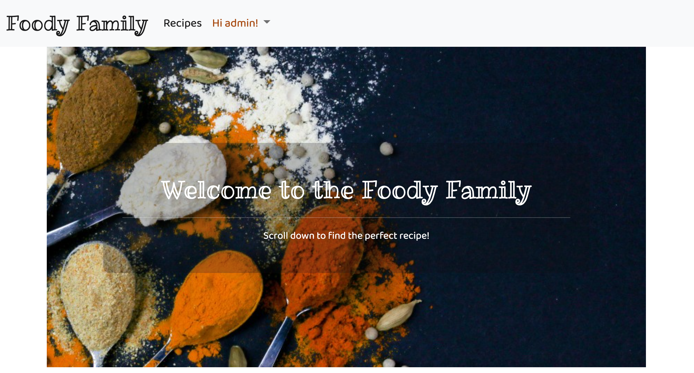

- Navbar - All Users 

- Navbar - Community Users 

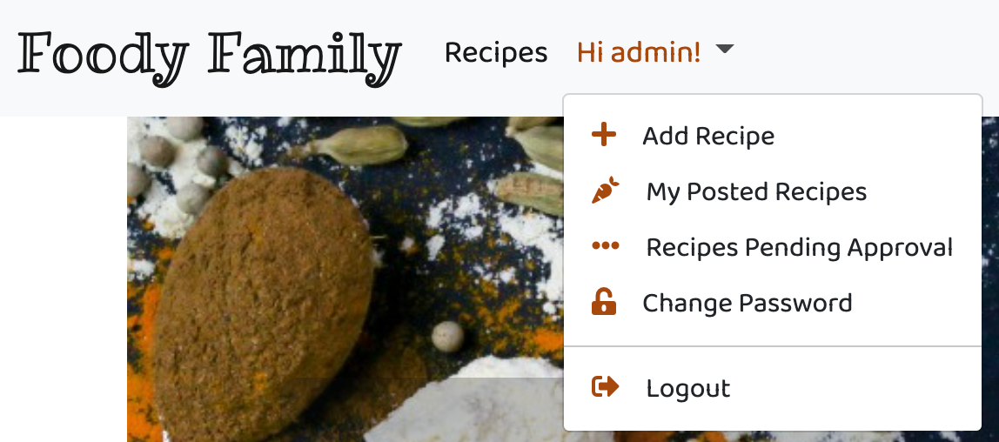

- View All Recipe cards - All Users

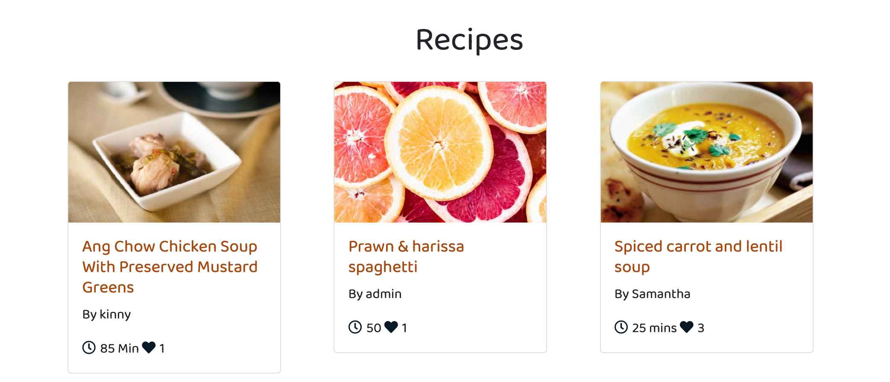

- Create an account - All Users

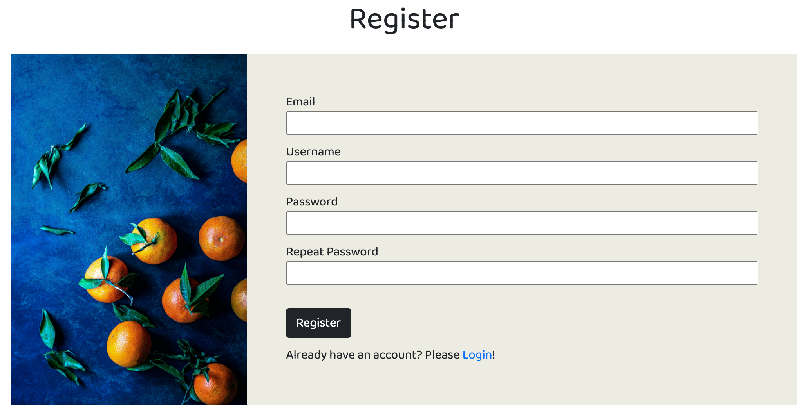

- Login - Community User 

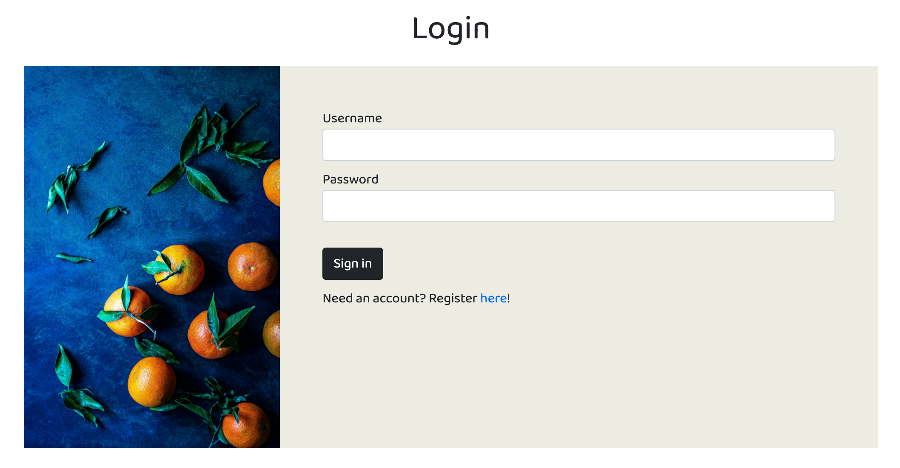

- Change Password - Community User

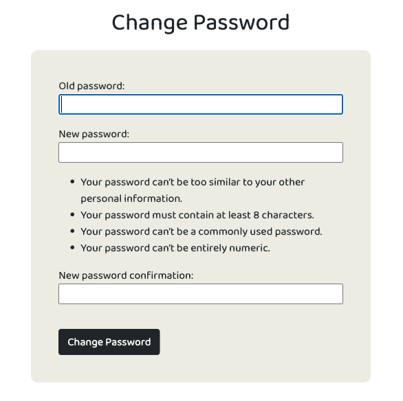

- Create, edit, read and delete all Recipes - Admin & Community User

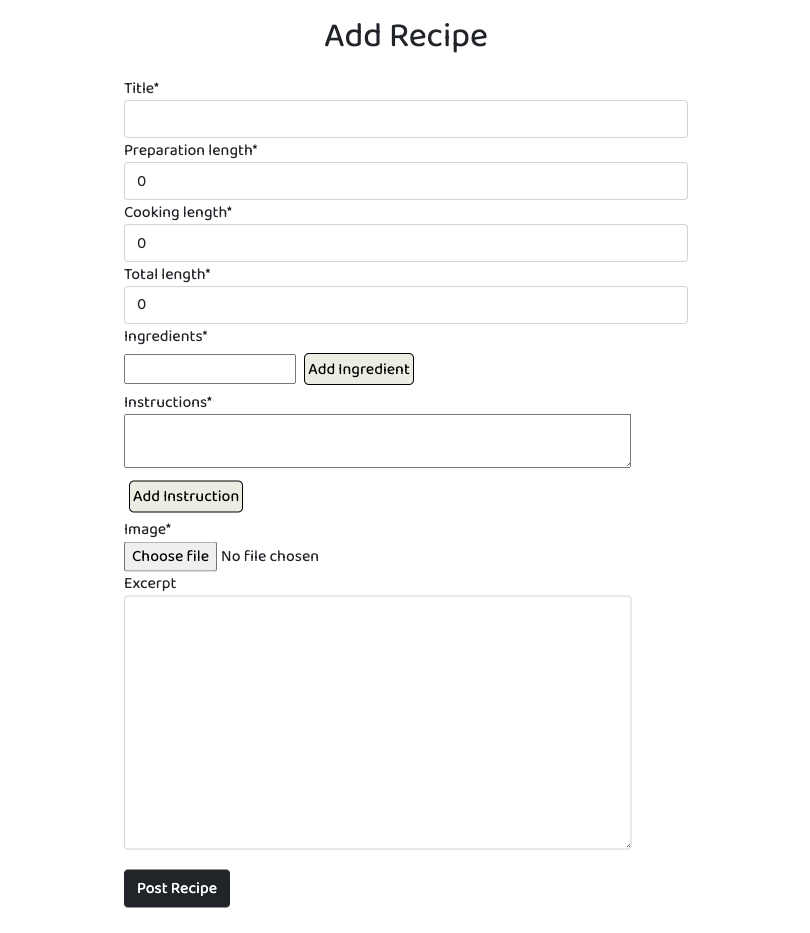

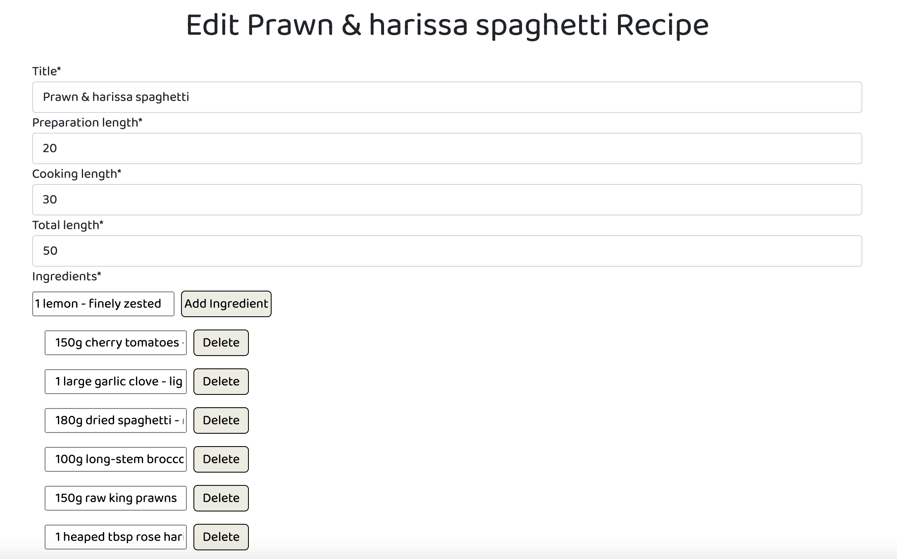

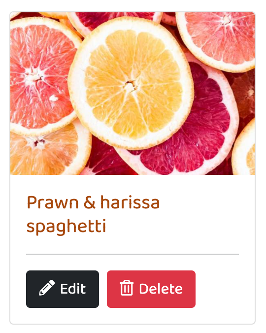

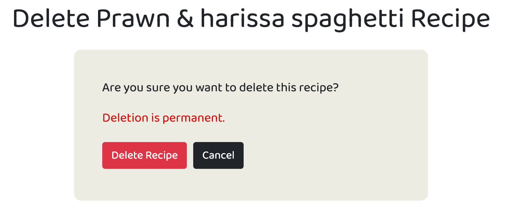

- View User's Posted Recipe Card (for editing/deleting) - Community User

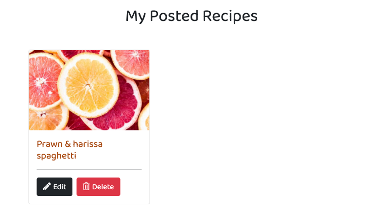

- View User's Pending Recipe Card (for editing/deleting) - Community User

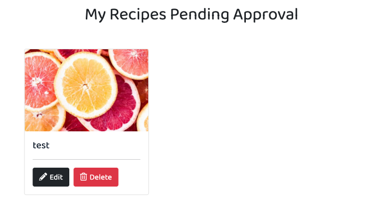

- View Number of like - All Users

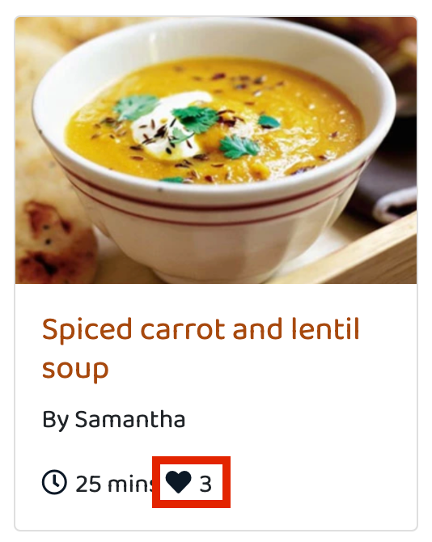

- Like Recipes - Community Users

- View Full Recipe Details - All Users

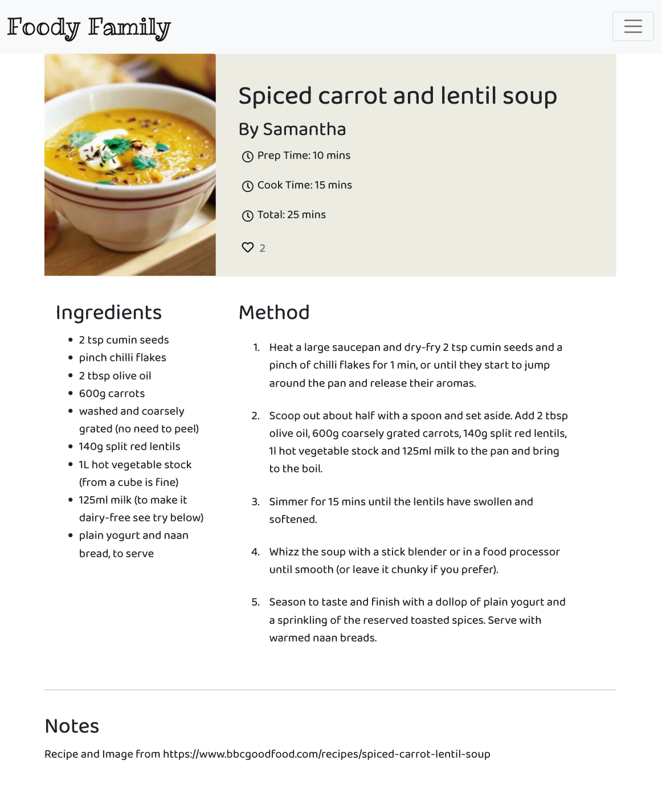

- Footer - All Users

## Colour Scheme 

The colour scheme for the project was put together using [Adobe Color](https://color.adobe.com/create/image) by uploading the landing page image. The colour scheme decided is:

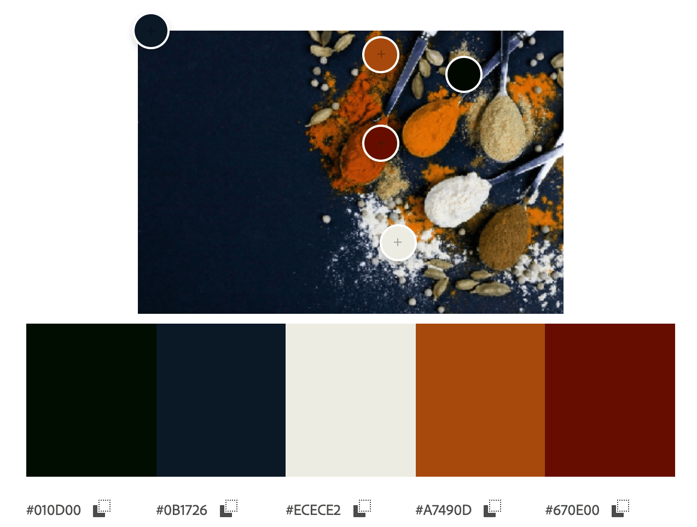

## Font Choice

For the Foody Family Logo I chose to use Ribeye Marrow with Roboto as a fallback font. 

For the remainder of the project the font I have chosen is Baloo Thambi 2, also with a fallback font of Roboto. 

## Favicon 
I created a basic Favicon for this project using [Canva](https://www.canva.com/). 

# Features to be Implemented
- Follow other users 
- Search/Filter Options 
- Save Recipes to favourites 
- Comment on recipes
- Contact Form
- Newsletter and new recipe updates email subscription

# Wireframes
All wireframes were created used [Balsamiq](https://balsamiq.com/)

Foody Family Wireframes for Mobiles, Tablets and Desktop devices can be viewed [here](assets/documents/Wireframes.pdf).

# Structure
I have kept the structure simple to not crowd the user with information. The homepage contains all of the recipes that are approved by the superuser/admin, which is also paginated therefore limits the recipe cards to 12 per page. 

The website is made of two apps:
1. Recipes
2. Users

All visitors to the site can view recipes, however a user must register/login to have access to:
- Add Recipe
- Recipes Pending Approval (lists the users recipes not approved yet for editing or deleting)
- Posted Recipes (lists the users recipes approved tie view, edit or deleting)
- Change Password (Allows the user to change their password if there is a security issue)
## Databases

### User

For this I project I used Django's User model to store registration information allowing the users to create an account. Once an account has been created the user is able to create, update and delete their own recipes on the site. 

### Recipes

For the user to be able to upload their own recipes I have created the below Recipe Model:

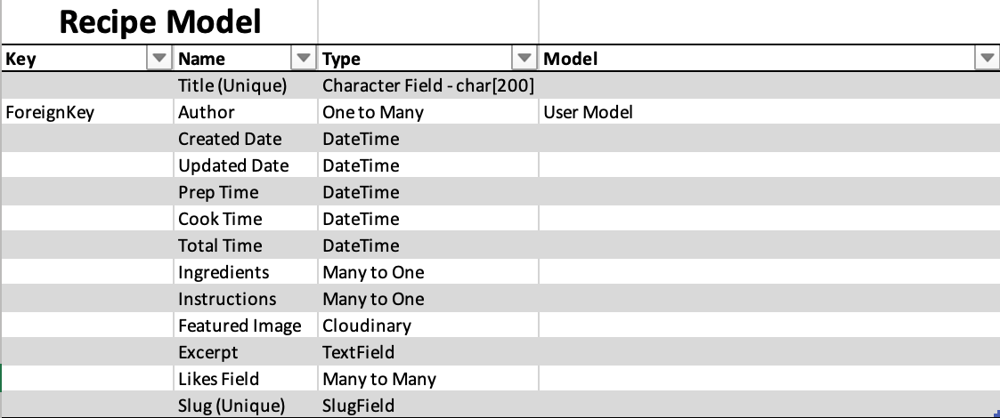

All fields are required apart from Author - which is based on the user who is currently logged in, Featured Image - which uses a placeholder if no image is uploaded and Excerpt - which is for the user to add any additional notes if required. 
# Technologies Used

## Languages Used

[html](https://en.wikipedia.org/wiki/HTML)

[CSS](https://en.wikipedia.org/wiki/CSS)

[Python](https://www.python.org/)

[JavaScript](https://www.javascript.com/)

## Frameworks, Libraries and Programmes Used 

[GitHub](https://github.com/) - Holds the repository of my project, GitHub connects to GitPod and Heroku.

[GitPod](https://gitpod.io/workspaces) – Connected to GitHub, GitPod hosted the coding space, allowing the project to be built and then committed to the GitHub repository. 

[Heroku](https://www.heroku.com/) - Connected to the GitHub repository, Heroku is a cloud application platform used to deploy this project so the backend language can be utilised/tested. 

[Django](https://www.djangoproject.com/) - This framework was used to build the foundations of this project, reducing time spent getting the project setup and prevent re-writing existing code.

[Gunicorn](https://gunicorn.org/) - Gunicorn is a pure-Python HTTP server for WSGI applications. It allows you to run any Python application concurrently by running multiple Python processes within a single dyno. It provides a perfect balance of performance, flexibility, and configuration simplicity.

[Dj Database URL](https://pypi.org/project/dj-database-url/) - This allows you to utilize the 12factor inspired DATABASE_URL environment variable to configure your Django application.

[Bootstrap](https://getbootstrap.com/) - Used to quickly add design to my website, Bootstrap focuses on mobile first design meaning this website is responsive across multiple devices ans screen sizes. 

[Cloudinary](https://cloudinary.com/?utm_source=google&utm_medium=cpc&utm_campaign=Rbrand&utm_content=492438439811&utm_term=cloudinary&gclid=Cj0KCQiAt8WOBhDbARIsANQLp96hTerzfFJ_P9lX0tEYEdtM3tSsYB6fhw-x3wQxOO0oc4hXm-A2ZBUaAptIEALw_wcB) - Used to store images online for the recipe posts. 

[Summernote](https://summernote.org/) Used to add a text area field to the admin setup to enable a list of ingredients and method steps.

# Testing
## Manual Testing by User Story
### **Superuser / Admin**
- As a Superuser I can approve and manage the recipes uploaded by community members so that anything unsafe can be removed from the website. 

This was tested by uploading recipes via the website and viewing them in the Django Admin Recipe Page. If a recipe is pending approval it appears in the admin as a draft recipe, waiting to be changed to published if all ok. If any issues, the recipe can be deleted on the admin panel. 

### **General User**
- As a General User I can look through a paginated list of recipes so that I can select a recipe to try out.

This was tested by ensuring all published recipes, by all authors, can be viewed on the homepage without logging in via comparing what is in the admin panel against what can be viewed on the homepage. 

- As a General User I can view an entire recipe so that I can learn new dishes.

This was tested by clicking either the recipe image or title to ensure the detail page loads and checking the title matches the title on the recipe card. This was further checked by viewing the details on the admin page compared to the websites recipe detail page to ensure they match. 

Both the recipe card and the recipe details can be viewed without being logged in. 

### **Community User**
- As a Community User I can log into my own account so I can update my Password if necessary.

This was tested by creating additional accounts and changing the password via the change password page for multiple users including the admin. This page is only visible if a user logged into their account. The user can only change their password if they input the correct current password. If a correct password or the new passwords do not match an error message is displayed to the user. 

- As a Community User I register an account so that I can create, update, and delete my own recipes.

This was tested by creating multiple accounts to ensure an error message appeared if the username was already taken or if passwords didn’t match.

- As a Community User I can like recipes I have tried so that other users may be encouraged to try them. 

This was tested by signing in as different users and liking recipes to see if the icon changed colour to indicated it had been liked/unliked and to check the total number of likes increased per recipe. 

## General Manual Testing 
**Add Recipe**
- Adding multiple recipes of various sizes to ensure:
    - Entire Recipe saved in the database, including all ingredients and instructions to be later displayed correctly in the recipe detail page.
- Image Upload testing:
    - Uploaded multiple recipes with and without an image to ensure any images uploaded were stored to Cloudinary, otherwise, the placeholder image was displayed. 
- Duplicate Recipe Titles:
    -   Checking an error message alerts the user of a duplicate title.
    - Added the author name to the recipe detail slug to allow for slightly more flexibility with recipe titles.
- Required Form Fields:
    - Submitting empty recipe form to ensure all required fields are notifying the user if left empty.
- Adding Ingredients and Instructions:
    - Using Google Chromes Inspect to check all entries are given a unique ID for editing later.
    - Clicking the add and delete buttons to make sure they add and remove the widgets. Double checking they are removed via the Recipe Detail page. 

**Edit Recipe**
- Retrieving the chosen recipe for editing:
    - Match the recipe details from the details view with the edit view across multiple recipes.
- Able to change and save changes to recipe:
    - Making changes and raising error messages if inputs are invalid, fields are blank or title is not unique.
    - Check changes are saved to the correct recipe by viewing the details after making changes. 

**Delete Recipe**
- Retrieving the chosen recipe to be deleted:
    - Checking the list of recipes to ensure the correct recipe was deleted
- Delete Confirmation:
    - Ensuring there is a confirmation page for the user so the recipe isn't automatically deleted.
    - Checked that although the delete button click, if not confirmed, the recipe is still on the recipe list (both the users list and homepage).

**View Recipe List**
- Visual check to see if only recipes that have been approved on the homepage. Checked against the Django Admin page. 
- Checked to see if approved recipes by all users are displayed on the home page. Checked against the Django Admin page. 
- Displays only the users posted recipes on the Posted Recipes Page. Checked the author of all recipes is the same on every recipe.
- Displays only the pending approval recipes on the Recipes Pending Approval Page. Checked the author of all recipes is the same on every recipe.
- Checked the placement of the recipe cards works on all screen sizes.
- Checked total recipe cards per page is 12 and that the pagination appears if there are multiple pages by adding over 12 recipes both by 1 user and multiple users. These were deleted later when testing the delete recipe functionality.  
- Checked the recipes are ordered by updated date by editing a recipe and checking it became the first recipe on the page. Also checked the order of the recipes in the admin to ensure it matched. 

**View Recipe Detail**
- Adding multiple recipes of various sizes to ensure:
    - The layout works as expected, especially on mobile devices where the page layout is as a list. On larger devices Ingredients and Method list side by side.  
    - The images displayed correctly, whether uploaded by the user or using the placeholder image instead.
    - The recipe details were displaying the correct recipe chosen to be viewed.

**Like Button in Details Page**
- Checked it works for all users and increments number of likes both on recipe details page and recipe cards by asking friends and family to create accounts to help test and by creating multiple accounts myself.

**User Registration**
- Raising error messages if Username already exists or passwords do not match. 
    - Checked this by trying to create users with the same username and also by creating users with a unique username and unequal passwords. Error message appears at top of page.

**User Login**
- Raising error messages if Username or Password incorrect
    I checked this by intentionally inputting incorrect data to see if the error message worked. Error message appears at top of page.
- Navbar displaying welcome message to the user upon logging in.
    - When a user logs in you will see message: *Hi username!* with a chevron next to it containing the additional pages available to registered users. 
- Access to personal recipe posts, both published and pending approval.
    - Navigated to each page to check if list of recipes matches what is in the database for the user. 

**User Logout**
- Removes access to additional functionality, only access to view recipes listed on the homepage. 
    - Tested by copying link to posted recipes page. All users still have access but cannot see anything as there is no user authentication. This is the same with the add recipes form but if the user attempts to post a recipe they will get a Server Error 500 as they aren't logged in to link the recipe to them. 

**Change Password**
- Able to change the user password.
    - Tested by changing the passwords for multiple users and logging in and out to ensure it worked.
- Error raised if incorrect current password input or if the new password entered twice doesn't match.
    - Tested by intentionally creating password errors and checking the page displays the message as it should. I then changed the password correctly to make sure these errors didn't cause an issue with correctly inputting passwords.

**Peer Code Review**
I have also submitted my project for Peer Code Review on Code Institutes Slack Channel and received some feedback to style the add ingredient and instruction buttons to make them more visible and make the error message display the issue. I have amended the error message to notify the user to complete all required fields, whereas before the request was to fix the error and I have added a darker colour to the buttons to make them more visible. 
# Validator Testing

- The HTML templates were validated using [W3 Validator](https://validator.w3.org/nu/#textarea). No errors were returned for the html segments.
- The CSS style sheet was validated using [W3C Validator](https://jigsaw.w3.org/css-validator/#validate_by_input), no errors were returned.
- The JavaScript files were run through [JSHint](https://jshint.com/). Received the following warning message - 'let' is available in ES6 (use 'esversion: 6') or Mozilla JS extensions (use moz). This is a warning that browsers implementing versions of JS prior to es6 won't understand let. I added ***/* jshint esversion 6 */*** to the top of my JS pages to let jshint know that the minimum language version I am targeting is es6.

- The code was validated using [PEP8](http://pep8online.com/). No errors were returned.

- The finished project was also run through [Wave](https://wave.webaim.org/) to check for issues with contrast styling and html structure. A warning was raised for the Bootstrap cards as the title is a H1 element and then the Author is a H5 element but this is how Bootstrap has coded their Cards.

# Bugs Found 

I encountered the following issues whilst building this project:
- Summernote's text area boxes were not displaying as lists on the webpage. To fix this I added |safe to the code linking to those model fields which removed the tags and displayed them as the lists they are. 
- The above then created an issue when creating in the add and edit recipe pages to the app as I couldn't user the Summernote functionality on the webpage. To fix this I created two widgets using JavaScript that appended inputs into an array that was then split to be displayed as a list to the user, giving each item it's own unique ID to enable a delete.
- My registration redirect wasn't redirecting as expected. To fix this I removed the URL from the 'form action' to make this an empty string instead. 
- Login success and error message not showing. To fix this I changed my url path from Django's LoginView to load my own template. 
- User image uploads weren't uploading to Cloudinary. To fix this I added  above and enctype="multipart/form-data" to the add and update recipe forms.
- Console Error for JavaScrip Message Timeout - alert.js:23 Uncaught TypeError: Cannot read properties of null (reading 'defaultPrevented'). To fix this I amended the timeout function in the script.js file to work only if there is a message present. 

# Deployment 

This project was deployed using Heroku. Some of the steps in this deployment process are used to get the bare minimum of this project up and running prior to adding functionality. 

See the following steps to deploy below:

1. Login to Heroku and Create a New App.

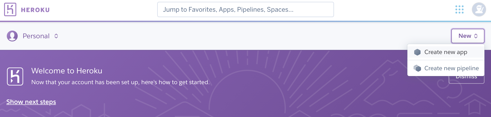 

2. Give the App a name, it must be unique, and select a region. 

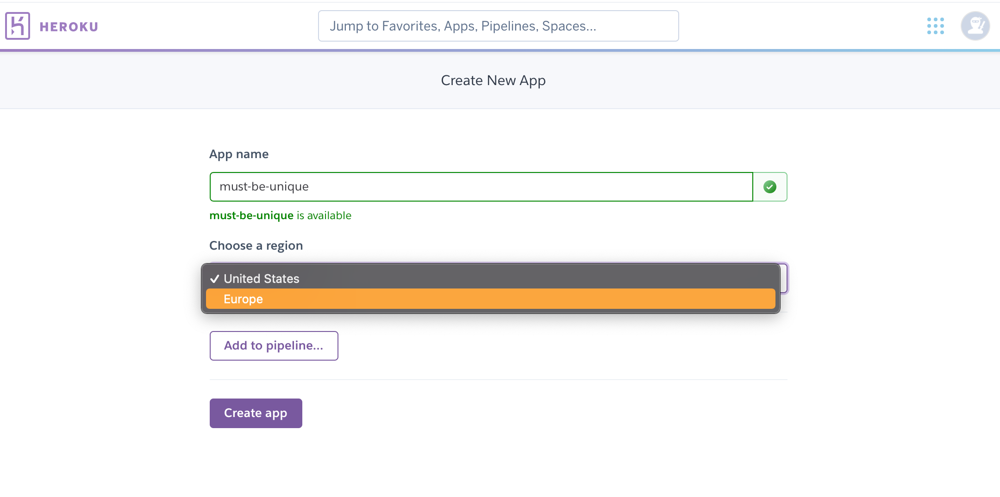 

3. Click on 'Create App'. This will take you to a page where you can deploy your project. 

4. Next, click on the 'Resources' tab and search for 'Heroku Postgres' in the Add-ons section to add the Heroku Postgres database to the project. 

5. Click on the 'Settings' tab at the top of the page. The following steps must be completed before deployment.

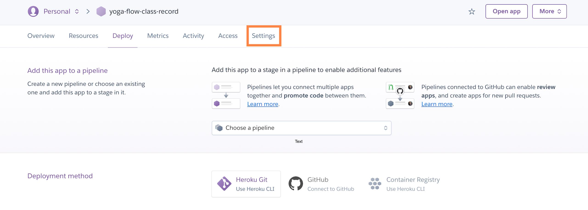 

6. Scroll down to Config Vars (also known as Environment Variables) and click 'Reveal Config Vars'. Here the database URL is stored, it is the connection to the database, so this must be copied and stored within env.py file within the same directory as the manage.py file. 

The env.py files is where the projects secret environment variables are stored. This file is then added to a gitnore file so it isn't stored publicly within the projects repository.  

7. Next, the secret key needs to be created within the projects env.py file on GitPod and then added to the Config Vars on Heroku. Once added, go to the settings.py file on GitPod.

8. Within the settings.py file you need to import os, import dj_database_url and then write an if statement to import the env.py file in production to avoid an error. 

9. Then, we need to replace the current insecure secret key with **os.environ.get('SECRET_KEY')**, that we set within the env.py file. 

10. Once the secret key is replaced, scroll down to DATABASES to connect to the Postgres database. Comment out the current code and add the following python dictionary:
DATABASES = {
    'default': dj_database_url.parse(os.environ.get('DATABASE_URL'))
}

11. The next step is to connect the project to Cloudinary, which is where the media files will be stored. Log into Cloudinary and copy the API environment variable. This needs to be added to the Config Vars on Heroku and to the projects env.py file, removing the 'CLOUDINARY_URL = ' from the beginning of the copied API link. 

12. Then on Heroku add to the Config Vars, DISABLE_COLLECTSTATIC = 1, as a temporary measure to enable deployment without any static files, this will be removed when it is time to deploy the full project.

13. Back onto GitPod, the cloudinary libraries installed now need to be added to the list of installed apps within the settings.py file - 'cloudinary_storage' and 'cloudinary'

14. Next we need to tell Django to use Cloudinary to store our media and static files. Toward the end of our settings.py  file we can add:

- STATIC_URL = '/static/'
- STATICFILES_STORAGE = 'cloudinary_storage.storage.StaticHashedCloudinaryStorage'
- STATICFILES_DIRS = [os.path.join(BASE_DIR, 'static')]
- STATIC_ROOT = os.path.join(BASE_DIR, 'staticfile')
- MEDIA_URL = '/media/'
- DEFAULT_FILE_STORAGE = 'cloudinary_storage.storage.MediaCloudinaryStorage'

15. Then we need to tell Django where the templates will be stored. At the top of settings.py, under BASE_DIR (the base directory), add a templates directory and then scroll down to TEMPLATES and add the templates directory variable to 'DIRS': []. 

16. Next, create the three above directories, media, static and templates, on the top level with the manage.py file. 

17. Now add our Heroku host name into allowed hosts in our settings.py file, APP_NAME.herokuapp.com, and then also add 'localhost' so the app can also run locally.

18. Finally, to complete the first deployment set up of the skeleton app, create a Procfile so that Heroku knows how to run the project. Within this file add the following:
web: gunicorn foody_family.wsgi
Web tells Heroku to allow web traffic, whilst gunicorn is the server installed earlier, a web services gateway interface server (wsgi). This is a standard that allows Python services to integrate with web servers.

19. Now, go to the 'Deploy' section on Heroku. Find the 'Deployment Method' section and choose GitHub. Then, connected to the relevant GitHub Repository by searching the repository name and clicking 'Connect'.

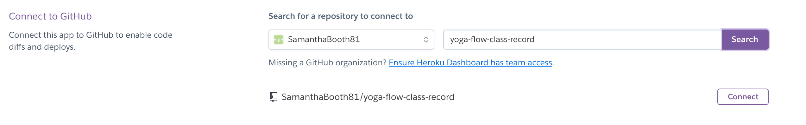 

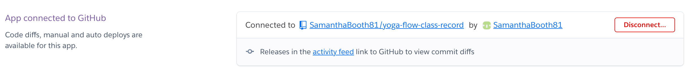 

20. Scroll down to the Automatic and Manual Deploys sections. I then clicked 'Deploy Branch' in the Manual Deploy section and waited as Heroku installed all dependencies and deployed my code. 

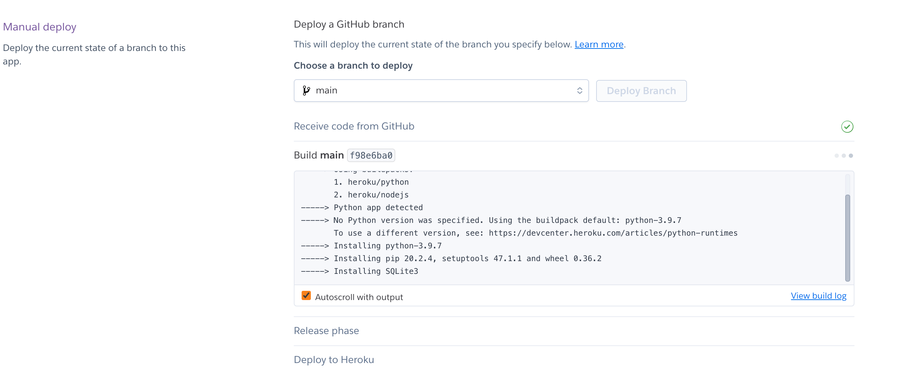 

21. Once the project is finished deploying, click 'view' to see the newly deployed project. 

22. Before deploying the final draft of your project you must: 
- Remove staticcollect=1 from congifvars within Heroku 
- Ensure DEBUG is set to false in settings.py file or:
    - Set DEBUG to development with: *development = os.environ.get('DEVELOPMENT', False)* above it.

23. To deploy re-do steps 19 - 21, minus reconnecting your GitHub account as it should still be connected to your App. 

# Credit
## Content 

I used the following websites to help with different areas of my project:
### Login, Logout & Registration
- [Django - How to log a user out](https://docs.djangoproject.com/en/4.0/topics/auth/default/#how-to-log-a-user-out), to help get the logout functionality working.
- [Coding Entrepreneurs - Django Logout View](https://www.youtube.com/watch?v=66abhpAxMgQ), to help create the Login functionality. 
- [Denis Ivy - User Registration and Login Authentication](https://www.youtube.com/watch?v=tUqUdu0Sjyc), used to help put together Login, Logout and Registration functionality.
- [Stack Overflow - Django logout not working](https://stackoverflow.com/questions/14021913/django-logout-not-working), to correct my url path for the logout function.
- [Django - form.errors](https://docs.djangoproject.com/en/4.0/ref/forms/api/#django.forms.Form.errors), used to figure out how to use form.errors.
- [Hacker Shack - Login Path](https://www.youtube.com/watch?v=Rz6racFuW_Q), used to help put the url path together for the login page.
- [Stack Overflow - redirect() not redirecting](https://stackoverflow.com/a/62678554), to figure out why I wasn't being redirected after registering an account.
- [The Pylot - Create Advanced User Sign Up](https://dev.to/thepylot/create-advanced-user-sign-up-view-in-django-step-by-step-k9m), used to help put together the registration view. 
-[How to create user sign up view](https://simpleisbetterthancomplex.com/tutorial/2017/02/18/how-to-create-user-sign-up-view.html#basic-sign-up), help with registration view.
-[Advanced User Sign Up View](https://dev.to/thepylot/create-advanced-user-sign-up-view-in-django-step-by-step-k9m,), help with registration view.
- [Django Forms API](https://docs.djangoproject.com/en/4.0/ref/forms/api/), general reading on Django Forms, not to write specific code.

### Change Password
- [Professional Cipher - How to Create a Change Password View | Django Tips #9](https://www.youtube.com/watch?v=00sdVcuYki0), used to help with the change password view.

### Add Recipe Functionality
- [Stack Overflow Post](https://stackoverflow.com/a/67483341), used to help with creating code to append method and ingredients arrays to the relevant fields in the Recipe Model. 
- [Idle Coding Blog](https://idlecoding.com/creating-custom-slugs-in-django/), used to help create a custom slug using multiple fields in the database.
- [Django Documentation](https://docs.djangoproject.com/en/4.0/ref/forms/widgets/#textarea), used to change the Instructions widget from an input field to a textarea field. 
- [Cloudinary Documentation](https://cloudinary.com/documentation/django_image_and_video_upload), to allow users with an account to upload images.

### Update Posted Recipe Functionality
- [Stack Overflow](https://stackoverflow.com/a/67937708), to help with the success message once posted recipe was edited. 

### Delete Posted Recipe Functionality
- [Stack Overflow](https://stackoverflow.com/a/25325228), to help with success message once posted recipe had been deleted. 

### Update Draft Recipe Functionality
- [Stack Overflow](https://stackoverflow.com/a/67937708), to help with the success message once posted recipe was edited. 

### Delete Draft Recipe Functionality
- [Stack Overflow](https://stackoverflow.com/a/25325228), to help with success message once posted recipe had been deleted. 

### Add Recipe Form
- [Authenticating Add Recipe Form](https://forum.djangoproject.com/t/automatically-get-user-id-to-assignate-to-form-when-submitting/5333/7), used to check if the user is authenticated when submitting a new recipe to add them as the author in the Recipe database.
- [Slugify Text](http://www.learningaboutelectronics.com/Articles/How-to-slugify-text-in-Python.php), for how to slugify the recipe title and author to create a unique slug with some flexibility across users.
-[Create Recipes with a Form](https://www.python-academy.com/download/django_intro_2017/recipe_form.html), to help understand how to put together the add_recipe view. 
- [Django Widgets](https://docs.djangoproject.com/en/4.0/ref/forms/widgets/#customizing-widget-instances), general reading for ingredients and instructions multi input widgets.
- [Django add images to Cloudinary](https://www.youtube.com/watch?v=1T6G7Znrbfg), used to help upload images from the user to cloudinary.

### Edit Recipe Form 
[Determine correct user to edit post](https://www.youtube.com/watch?v=Y1Us5jVT07E), used to help structure code so that page can only be viewed if user is authenticated.
[Codemy - Update and Edit Blog Post](https://www.youtube.com/watch?v=J7xaESAddDQ), help with the update urls for pending and posted recipes. 

### Delete Recipe
[Codemy - Delete a Blog Post](https://www.youtube.com/watch?v=8NPOwmtupiI), used to help create the delete view and html code to delete recipe.

### Styling
- [Unsplash - Landing Image](https://unsplash.com/photos/DoUgSMezLp0)
- [Logo Font - Google Fonts](https://fonts.google.com/specimen/Ribeye+Marrow?category=Display&preview.text=Foody%20Family&preview.text_type=custom#standard-styles)
- [Unsplash - Recipe Placeholder Image](https://unsplash.com/photos/ezSFnAFi9hY)
- [Font Awesome Heart Likes Icon](https://fontawesome.com/v5.15/icons/heart?style=solid)
- [CSS object-fit property](https://www.w3schools.com/css/css3_object-fit.asp), used to fit recipe image correctly into the layout.
- [CSS-Tricks - Flexbox Sticky Footer](https://css-tricks.com/couple-takes-sticky-footer/), for the sticky footer code.
- [Unsplash - Login and Register form images](https://unsplash.com/photos/TAj4X5-eRqE)

# Acknowledgments
Thank you to all who encouraged and supported me as I created my first full stack website, especially to my mentor at Code Institute, Antonio, for his guidance, patience, encouragement and constant support, particularly with the Add Recipe Widgets. Also a massive thank you to Tutor Support at the Code Institute for never giving up on the difficult issues I found myself stuck on.  
